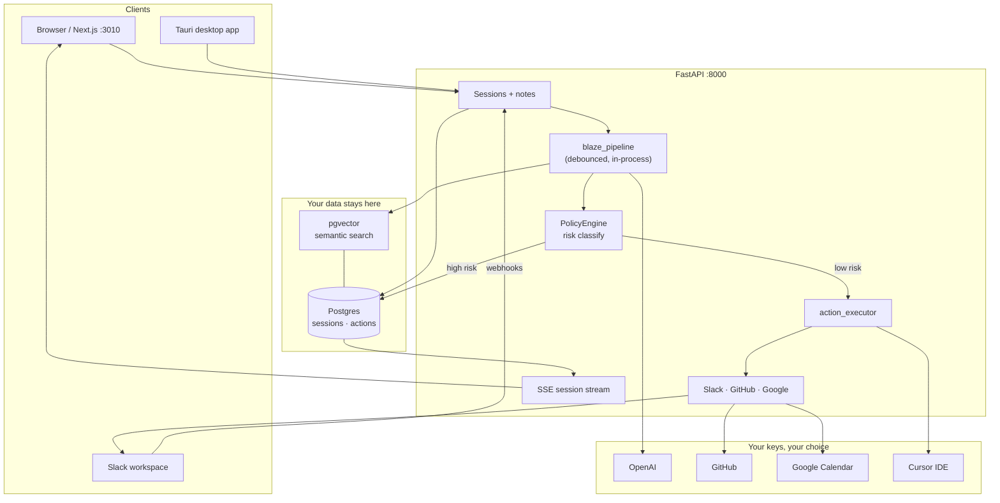

<div align="center">


# Blaze

**What gets decided shouldn't die in the transcript.**

Self-hosted, open source — your meetings stay on your stack, and the follow-up actually runs.

[](LICENSE)
[](https://nextjs.org/)
[](https://fastapi.tiangolo.com/)
[](https://github.com/pgvector/pgvector)

[Quick start](#quick-start) · [Architecture](#architecture) · [Open source](#open-source) · [Integrations](#integrations)

</div>

---

## What is Blaze?

Blaze listens to conversations (Slack huddles, pasted transcripts, GitHub threads), writes structured notes in real time, and turns decisions into actions — calendar holds, GitHub comments, Cursor handoffs. Low-risk actions run automatically; risky ones wait for your approval in the app or Slack.

Everything runs in **your** stack: Postgres + pgvector for storage and search, self-hosted API, bring-your-own API keys. No vendor lock-in on your meeting data.

## Quick start

**~5 minutes.** Demo login works without paid keys.

```bash
git clone https://github.com/LefterisXefteris/blaze.git
cd blaze

npm install
npm run setup:api

cp .env.example .env
# Set BLAZE_JWT_SECRET to any long random string
# DEV_DEMO_LOGIN=true is already in .env.example

npm run db:setup
npm run dev:all
```

Open [http://localhost:3010](http://localhost:3010) → **Enter demo**.

Add `OPENAI_API_KEY` when you want AI notes and semantic search. Slack, GitHub, and Google are optional — see [`.env.example`](.env.example).

### Docker stack (API + Postgres + Langfuse)

```bash
cp .env.example .env   # configure first
./run.sh up            # backend services
./run.sh dev           # UI in a second terminal
```

| Service | URL |
|---------|-----|
| UI | http://localhost:3010 |
| API | http://localhost:8000 |
| Langfuse | http://localhost:3100 |

Stop with `./run.sh down`. For Slack webhooks locally, run `ngrok http 8000` and use `./run.sh url` for the public URL.

## Architecture



**Flow:** capture → synthesize (live summary + vector context) → recommend (intent + risk) → act (auto or approve) → handoff (`.blaze/handoffs/` + Cursor).

## Open source

Blaze is **MIT licensed** and meant to be forked, self-hosted, and extended.

- **Your data, your region** — Postgres and the API run where you deploy them. Meeting transcripts, embeddings, and actions never need to leave your environment.
- **Bring your own keys** — OpenAI, Slack, GitHub, Google are optional plugins, not requirements.
- **Built to hack on** — Next.js frontend, FastAPI backend, Prisma schema, integration adapters in `backend/app/services/integrations/adapters/`.

Star the repo if it helps, open issues with ideas, and send PRs. The best version of Blaze is the one running on infrastructure you control.

## Integrations

Configure only what you need in `.env` — full template in [`.env.example`](.env.example).

| Integration | Unlocks |
|-------------|---------|
| `OPENAI_API_KEY` | Live notes, embeddings, intent extraction |
| Google OAuth | Sign-in + Calendar |
| GitHub OAuth + webhook | Issues, PRs, coding handoffs |
| Slack app | Huddle/channel capture, approval buttons |

**Cursor handoffs:** approve a coding-agent action → Blaze writes `.blaze/handoffs/*.md` and opens Cursor. See [desktop/README.md](desktop/README.md) for the Tauri companion.

## Project layout

```
blaze/
├── src/          # Next.js UI
├── backend/      # FastAPI API, pipeline, integrations
├── desktop/      # Tauri app (local Cursor handoffs)
├── prisma/       # Database schema
├── run.sh        # Docker stack helper
└── .env.example  # Environment template
```

## Troubleshooting

| Problem | Fix |
|---------|-----|
| DB errors | `docker compose up postgres -d` then `npm run db:setup` |
| API 401 | Check `BLAZE_JWT_SECRET` in `.env`, restart `dev:all` |
| Demo login missing | Set `DEV_DEMO_LOGIN=true` |

## License

[MIT](LICENSE) © Lefteris Xefteris
